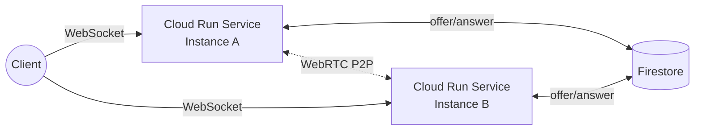
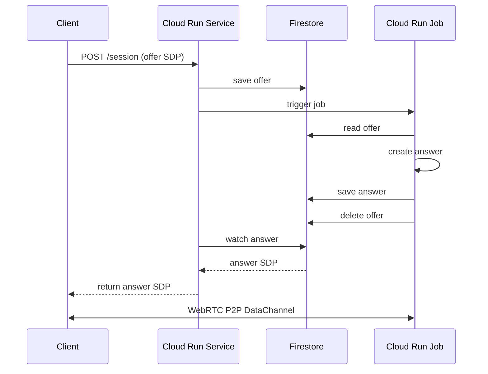

# Cloud Run WebRTC Peering

Google Cloud Run と WebRTC を使った P2P 通信のサンプルプロジェクト。Cloud Run Service/Job と Firestore を使ったシグナリングにより、クライアントとサーバー間で WebRTC DataChannel 接続を確立します。

関連記事　https://zenn.dev/shinyoshiaki/articles/cloudrun-webrtc-p2p-chat

## プロジェクト構成

このプロジェクトは pnpm workspace で構成されたモノレポです。

### cr-service

Cloud Run Service 単体の実装。Firestore をシグナリングに利用します。

- **server**: メッセージングサーバー（Hono + Node.js）
- **client**: React + Vite で構築された Web クライアント
- **infra**: Pulumi による GCP インフラストラクチャ管理

### cr-jobs

Cloud Run ServiceとCloud Run Jobs を組み合わせた実装。Firestore をシグナリングに利用します。

- **service**: HTTP エンドポイントで offer を受け取り、Cloud Run Job をトリガーするサービス
- **job**: Firestore から offer を取得し、WebRTC answer を生成するジョブ
- **client**: Node.js クライアント（werift 使用）
- **infra**: Pulumi による GCP インフラストラクチャ管理

## アーキテクチャ

### cr-service



クライアントは WebSocket で Cloud Run Service に接続し、メッセージを送受信します。
複数の Service インスタンスは Firestore を介してシグナリングを行い、インスタンス間で WebRTC P2P 接続を確立します。

### cr-jobs



クライアントは HTTP で offer を送信し、Cloud Run Job が answer を生成します。
シグナリング完了後、クライアントと Job 間で WebRTC P2P 接続を確立します。

## 必要な環境

- Node.js 20+
- pnpm 10.17.1+
- Docker（ローカル開発用）
- Google Cloud Platform アカウント（本番デプロイ用）

## セットアップ

### 依存関係のインストール

```bash
pnpm install
```

### Firestore エミュレータの起動

```bash
pnpm compose:up
```

Firestore エミュレータが `localhost:8080` で起動します。

### 開発サーバーの起動

#### cr-service の場合

```bash
# サーバーを起動
pnpm dev

# クライアントを起動（別ターミナル）
pnpm dev:client
```

#### cr-jobs の場合

```bash
# サービス + ジョブを自動起動
pnpm --filter @cloud-run-webrtc-peering-jobs/service dev

# クライアントを実行
pnpm --filter @cloud-run-webrtc-peering-jobs/client dev
```